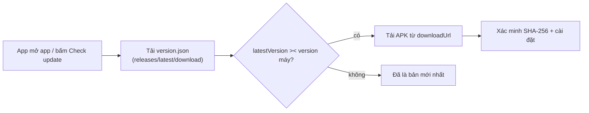

# MedCore Mobile — Release Distribution Repo

Repo này **chỉ dùng để phân phối** app Android MedCore Hospital (APK + metadata check-update). Toàn bộ **source code nằm ở máy local** (`F:\CORE_MEDICAL_MB`), không bao giờ commit vào đây.

> ⚠️ Không đặt source code, keystore, secret hay token nào vào repo này.

## Cơ chế auto-update hoạt động thế nào?



- **Check-update URL (app phải poll):** `https://github.com/kukenitc2-lang/medcore-mobile-releases/releases/latest/download/version.json`
  - Redirect 302 qua CDN GitHub → luôn trả manifest của Release mới nhất, không rate-limit kiểu API, không cần token.
- **Link tải APK (luôn bản mới):** `https://github.com/kukenitc2-lang/medcore-mobile-releases/releases/latest/download/MedCore_Hospital.apk`
- **Link theo đúng 1 version** (dùng khi rollback/debug): `.../releases/download/v<version>/MedCore_Hospital.apk`

Source of truth = **assets của Release**, không phải file trong git.

## Quy trình phát hành

1. Build APK release trong repo nguồn (`F:\CORE_MEDICAL_MB`) bằng keystore production.
2. Publish bằng 1 lệnh (script tự validate, tự tính SHA-256, tự tạo tag):

```powershell
node push_release.cjs `
  --apk android/app/build/outputs/apk/release/app-release.apk `
  --version 0.0.0.116 `
  --notes "Sửa lỗi PDF viewer" `
  --notes "Cải thiện hiệu năng danh sách bệnh nhân"
```

Tuỳ chọn:
- `--mandatory` — đánh dấu bản bắt buộc cập nhật (`isMandatory`/`forceUpdate` = true; dùng cho bản Security fix).
- `--min-required 0.0.0.110` — đặt ngưỡng version tối thiểu buộc cập nhật.
- `MEDCORE_DRY_RUN=1` — chỉ xem trước manifest, không publish.

Script tự chặn: version giảm, release trùng tag, APK không tồn tại. Script **không đụng git** — toàn bộ artifact nằm trên Release.

## Schema `version.json`

| Trường | Ý nghĩa |
|---|---|
| `latestVersion` | Version mới nhất, định dạng `X.Y.Z.W` (segment cuối = `buildNumber`) |
| `minRequiredVersion` | Version tối thiểu; thấp hơn mức này app phải bắt buộc cập nhật |
| `buildNumber` | Số build tăng dần — **app nên so sánh theo trường này** |
| `releaseDate` | Ngày phát hành (YYYY-MM-DD) |
| `releaseNotes` | Mảng ghi chú (UTF-8, hiển thị trên modal update) |
| `downloadUrl` | Link APK bản mới nhất (cố định, không bao giờ rot) |
| `apkSha256` | Hash SHA-256 (chữ hoa) — app nên xác minh trước khi cài |
| `fileSize` | Kích thước APK, ví dụ `18.8 MB` |
| `isMandatory` / `forceUpdate` | Cờ bắt buộc cập nhật |

## Rollback

- App poll `releases/latest/download/version.json` (bản mới nhất) → để quay về bản cũ: xoá Release mới nhất (`gh release delete v0.0.0.116 --cleanup-tag`) rồi publish lại bản cũ, hoặc yêu cầu người dùng cài link version cụ thể.
- Tag `v<version>` đánh dấu thời điểm phát hành trên lịch sử repo.

## Lịch sử & dung lượng

APK **không còn được commit vào git** (trước đây làm repo phình ~1.2 GiB). Các blob cũ vẫn nằm trong lịch sử — kế hoạch dọn bằng `git filter-repo` sẽ được thực hiện riêng khi cả team đã đồng bộ.

## Lỗi hay gặp

- `gh: Not Found` khi publish → chưa `gh auth login` hoặc thiếu quyền push.
- `Release vX đã tồn tại` → dùng version mới hơn; không tái sử dụng tag đã phát hành.
- Notes hiển thị lỗi font → đảm bảo terminal dùng UTF-8 (script luôn ghi UTF-8).
